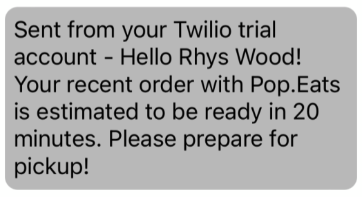

Pop.Eats - A Project by [Rhys](https://github.com/RhysWood), [Bryson](https://github.com/brysonbest) & [Lenil](https://github.com/lenilsamuel)
=========

## Overview
Pop.Eats is a single restaurant ordering app created by [Rhys](https://github.com/RhysWood), [Bryson](https://github.com/brysonbest) & [Lenil](https://github.com/lenilsamuel). The app serves as an intermediary for both the client (customer) and the restaurant. 

Customers can log in, place orders, view their previous orders and update their profile. As a restaurant owner, the user can also update the menu as well as accept and process orders. When an order is placed, the user recieved a text confirming receipt and showing the restaurants estimated pick-up time. 

## Features

> Customers can log in and add to their cart before placing their order for pick-up or pay online.

> Customers are able update their profile details

> Restaurant owers can process their orders and give an estimated time for the order, which is then texted to the customer using Twilio

> Users recieves a text upon receipt of order

> Restaurant ower recieved text to notify them of a new order

> Once the restaurant gives an estimated time it is texted to the user

> When the order is ready, the user is notified by text

## Stretch Work

- Google Maps API showing the 2 restaurant locations.
- Google Pay integration allowing customers to pay for their order safely online. 
- Responsive design. The restaurant is accessable on phone, tablet and desktop.

## Dependencies

- Node 10.x or above
- NPM 5.x or above
- PG 6.x
